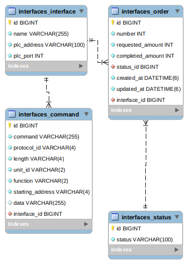
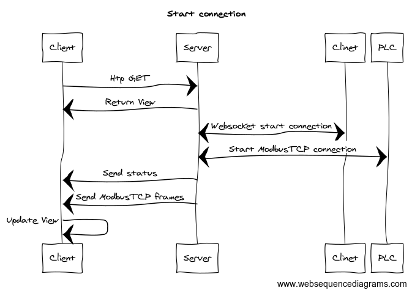
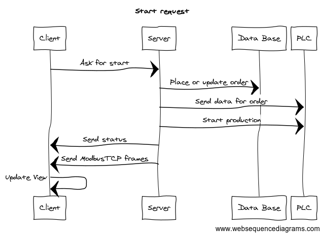
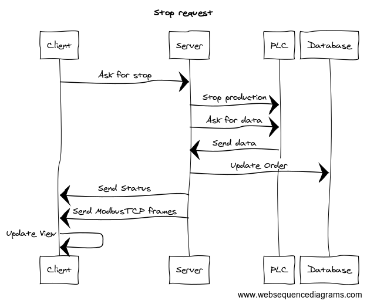
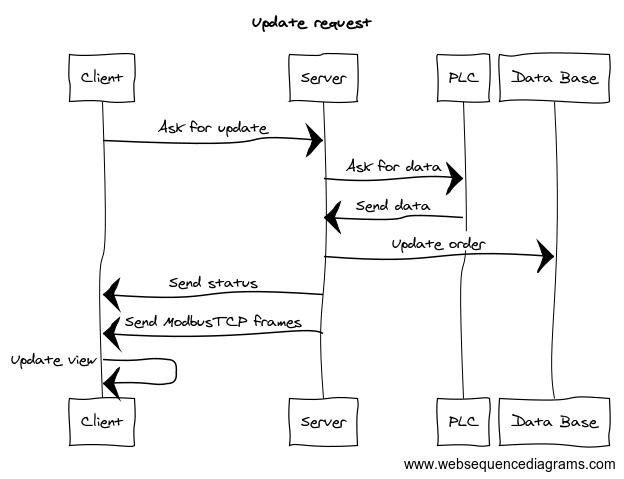

1. [ Testowanie i Prezentacja ]( #test )
2. [ Model danych ]( #model )
3. [ Schemat działania aplikacji ]( #schemat )

## 1. Testowanie i Prezentacja
Ze względu na użycie biblioteki `channels` tesy nie działają dla SQLite3.

W celach prezentacji nakezy użyć `dummyPLC.py`. Który symuluje server PLC ModbusTCP.

## 2. Model danych

## 3. Schemat dizałania aplikacji

### Otwarcie panelu

### Przycisk Start

### Przycisk Stop

### Cykliczny update co 500ms
